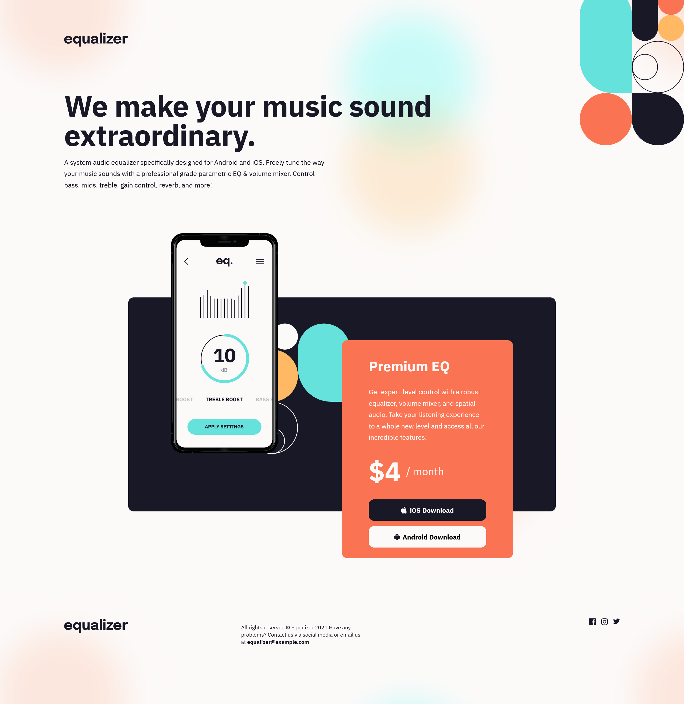

# Frontend Mentor - Equalizer landing page solution

This is a solution to the [Equalizer landing page challenge on Frontend Mentor](https://www.frontendmentor.io/challenges/equalizer-landing-page-7VJ4gp3DE). Frontend Mentor challenges help you improve your coding skills by building realistic projects.

## Table of contents

-   [Overview](#overview)
    -   [The challenge](#the-challenge)
    -   [Screenshot](#screenshot)
    -   [Links](#links)
-   [My process](#my-process)
    -   [Built with](#built-with)
    -   [What I learned](#what-i-learned)
-   [Author](#author)

## Overview

### The challenge

Users should be able to:

-   View the optimal layout depending on their device's screen size
-   See hover states for interactive elements

### Screenshot



### Links

-   Solution URL: [Frontendmentor](https://www.frontendmentor.io/solutions/responsive-landing-page-using-vanilla-html-and-css-Vc5zd_u3gV)
-   Live Site URL: [Github pages](https://taxato.github.io/equalizer-landing-page/)

## My process

### Built with

-   Semantic HTML5 markup
-   CSS custom properties
-   CSS Media queries
-   Flexbox

### What I learned

I learned a lot about what makes responsive layouts tricky, how to use media queries, and also how to color svgs.

```css
.socials svg {
	transition: fill 300ms;
	fill: var(--color-black);
}

.socials a:hover,
.socials a:focus {
	svg {
		fill: var(--color-orange);
	}
}
```

## Author

-   Website - [TGS Portfolio](https://taxato.github.io/TGS-Portfolio/)
-   Frontend Mentor - [@Taxato](https://www.frontendmentor.io/profile/Taxato)
